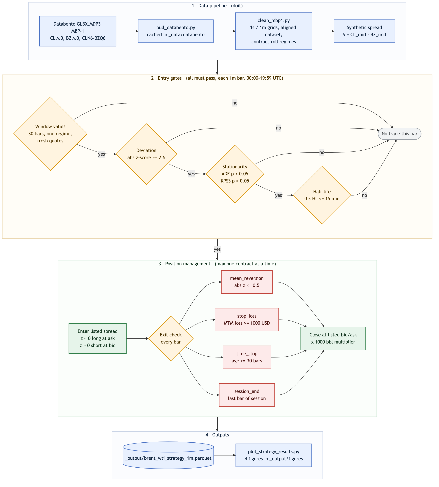
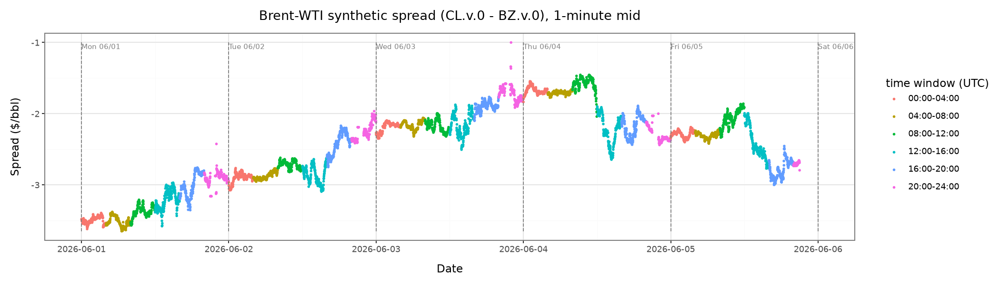
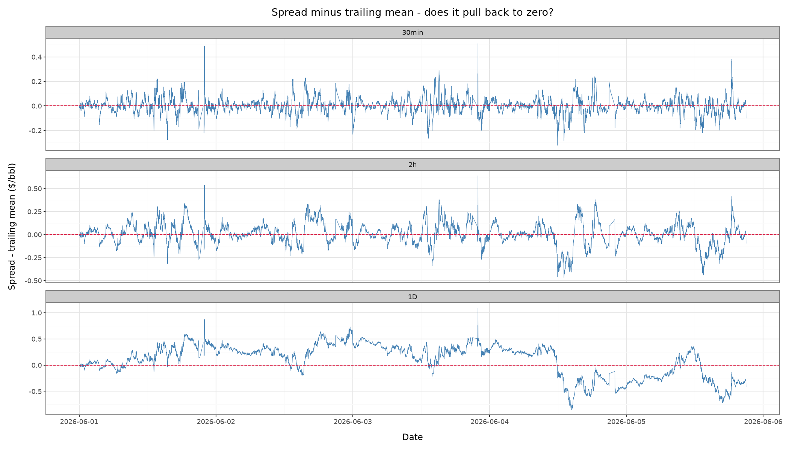

# FINM 37000 Group 6 — Intraday Brent–WTI Mean-Reversion Strategy

## Overview and Results

This project builds and backtests an end-to-end **intraday mean-reversion strategy on the Brent–WTI crude-oil spread** using CME Globex MBP-1 market data from Databento. The final pipeline downloads the market data, constructs synchronized one-minute datasets, generates statistically filtered trade signals, executes those signals against the exchange-listed Brent–WTI spread, calculates executable P&L, and produces a set of backtest figures. The entire production workflow is reproducible with a single `doit` command once a Databento API key is supplied.

The main result is **negative**: the implemented mean-reversion specification does not earn its execution costs. Over the June 1–5, 2026 pilot week the default 2.5σ specification fires only **4 trades in 6,000 eligible minutes** and finishes **+\$330**, but a single trade contributes +\$420 while the other three net −\$90 combined — a sample too small to distinguish from zero. Extending the same specification to twelve weekly blocks spanning 2023–2026 settles the question: **145 trades for −\$1,900**, with only 2026 profitable. Lowering the entry threshold created more opportunities without making the strategy reliably profitable. Rather than optimize aggressively to a small sample, we preserve a transparent baseline that demonstrates the full research and execution framework and shows where the economic intuition does not survive realistic market-data and execution constraints. The trade log and entry-gate funnel are on the [Strategy Results](docs_src/strategy_results.md) page, the twelve-week runs on [Multi-Week Backtest](docs_src/multi_week_backtest.md).

## Pipeline Overview

The four bands below map to the `doit` task chain: data acquisition and cleaning, the three entry gates applied to every one-minute bar, position management through to an exit, and the saved outputs.

## Data and Spread Construction

The pipeline pulls Databento `GLBX.MDP3` **MBP-1** data for the volume-rolled front contracts `CL.v.0` (WTI) and `BZ.v.0` (Brent), together with exchange-listed Brent–WTI spread instruments. Raw DBN files are cached under `_data/databento/`, so subsequent runs do not repurchase data.

`src/clean_mbp1.py` converts the event data to fixed **1-second and 1-minute** grids and builds an aligned dataset. The strategy signal is based on the synthetic spread

$$
S_t = CL_t - BZ_t,
$$

using the midpoint of each outright's best bid and ask. During the pilot week the front listed spread `CLN6-BZQ6` matches the contracts underlying the two continuous outrights, so it is used for execution: long positions enter at its ask and exit at its bid, short positions the reverse. Backtest P&L pays the observed bid–ask spread rather than assuming midpoint fills.

Contract rolls are handled explicitly: each row retains the underlying CL and BZ instrument IDs, and a rolling window is valid only if every observation belongs to the same `(CL contract, BZ contract)` regime, with consecutive one-minute bars and active, non-stale outright quotes. This prevents spread jumps from continuous-contract splicing being mistaken for mean-reversion signals.

## What the Spread Looks Like

`doit spread_diagnostics` regenerates six figures that motivate the design; two carry most of the argument.

Over the pilot week the spread trended from about −\$3.50/bbl to −\$1.50/bbl before retracing sharply. With no stable level to revert to, the design anchors on a trailing window rather than a long-run mean.

Choosing that window is a key trade-off: daily-horizon deviations may have no zero-crossings for a full day, while 30-minute deviations oscillate around zero with amplitude mostly within ±\$0.20/bbl. That small amplitude has to cover execution cost.

The remaining figures are documented in
[`docs_src/spread_diagnostics.md`](docs_src/spread_diagnostics.md).

## Strategy Logic

The strategy operates only from **00:00 through 19:59 UTC** and holds at most one listed-spread contract. The cutoff avoids the hour before the daily Globex maintenance halt at 21:00 UTC, when median quoted width blows out (see [`docs_src/spread_diagnostics.md`](docs_src/spread_diagnostics.md)). At every eligible minute, it forms a trailing rolling window and applies three entry gates:

1. **Deviation:** compute the spread z-score relative to its rolling mean and sample standard deviation. A sufficiently negative z-score proposes a long spread; a sufficiently positive z-score proposes a short spread.
2. **Stationarity:** by default, the rolling window must pass both an Augmented Dickey–Fuller test and a KPSS test at the 5% level. Either test can be disabled in `src/strategy_engine.py`.
3. **Half-life:** fit an AR(1) model to the spread window and convert the autoregressive coefficient to an estimated mean-reversion half-life. Entry is allowed only when the estimate is positive and below the configured maximum.

The default specification uses a **30-minute window**, **2.5σ entry threshold**, and **15-minute maximum half-life**. Once entered, a trade exits when the absolute z-score returns to **0.5 or less**, when mark-to-market loss reaches **\$1,000**, after **30 minutes**, or at the end of the trading session. P&L uses the listed-spread bid/ask and a **1,000-barrel contract multiplier**. All rolling calculations use only observations available through the current timestamp.

Backtest artifacts are listed on
[`docs_src/strategy_results.md`](docs_src/strategy_results.md), and the
2023–2026 weekly-block runs, which sit outside the `doit` chain, on
[`docs_src/multi_week_backtest.md`](docs_src/multi_week_backtest.md).
Setup and publishing instructions are in
[`docs_src/how_to_run.md`](docs_src/how_to_run.md).
