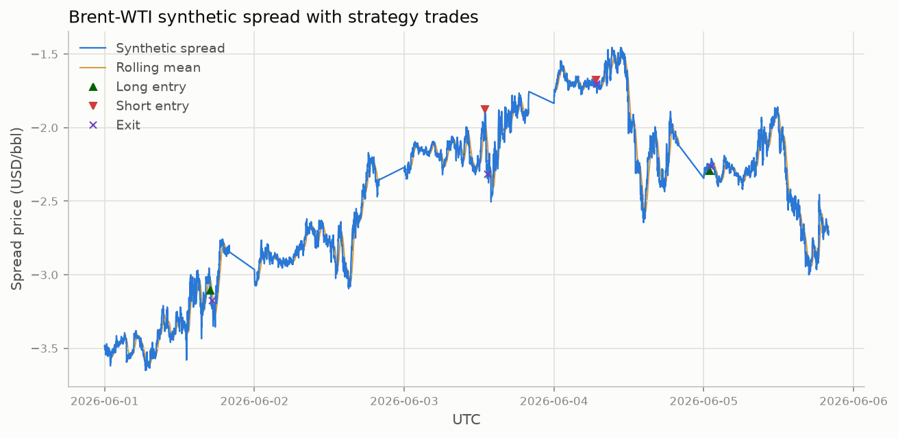
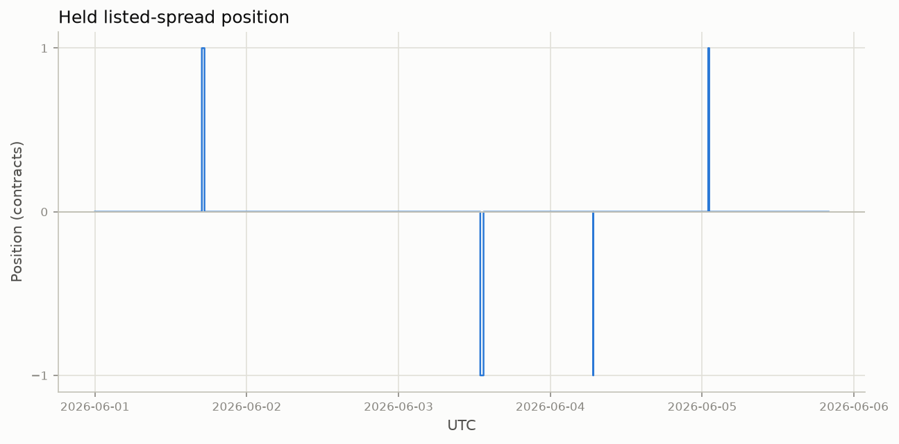
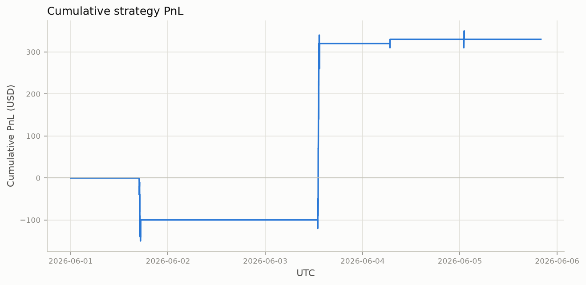
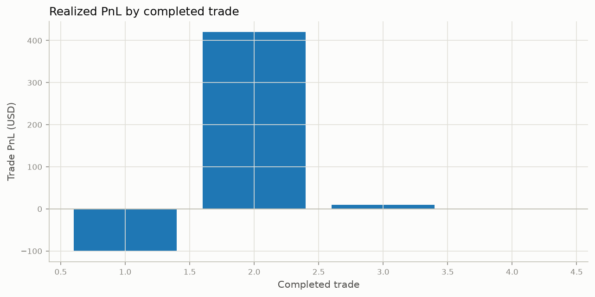
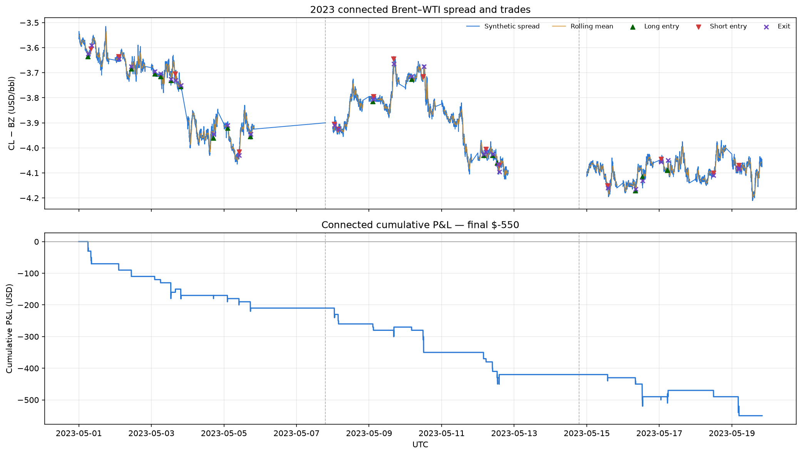
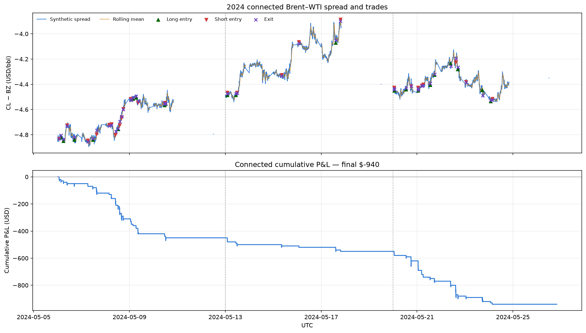
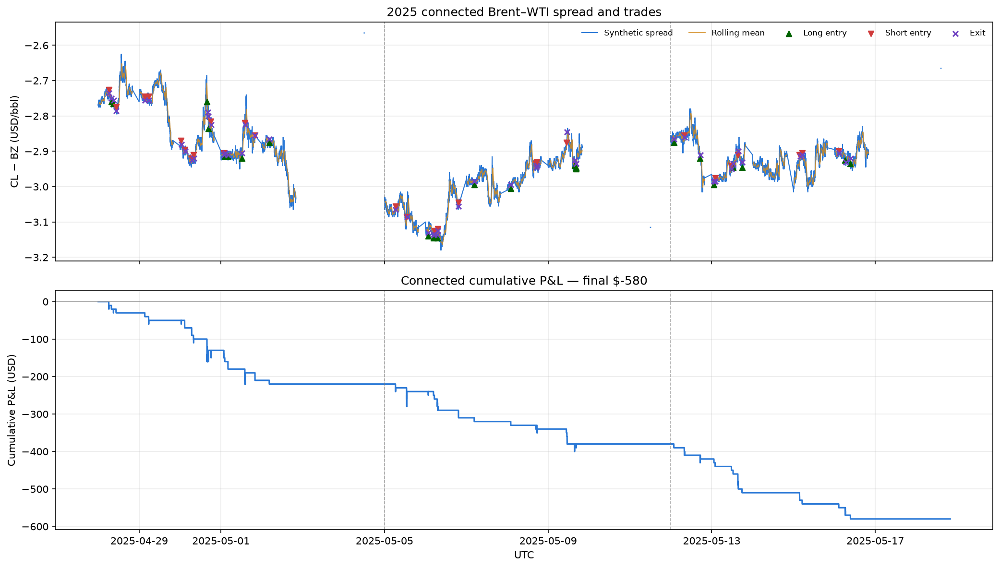
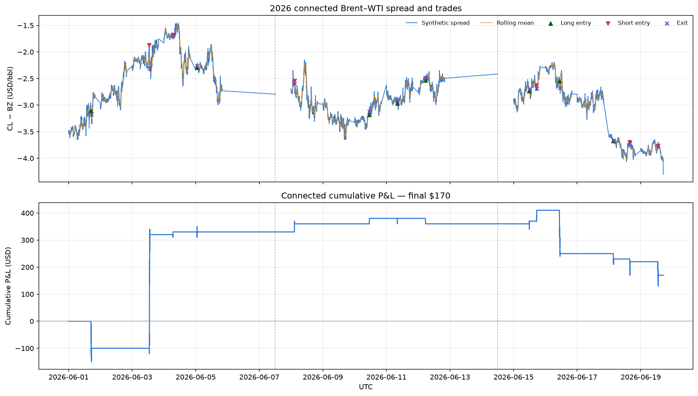

# FINM 37000 Group 6 — Intraday Brent–WTI Mean-Reversion Strategy

## Overview and Results

This project builds and backtests an end-to-end **intraday mean-reversion strategy on the Brent–WTI crude-oil spread** using CME Globex MBP-1 market data from Databento. The final pipeline downloads the market data, constructs synchronized one-minute datasets, generates statistically filtered trade signals, executes those signals against the exchange-listed Brent–WTI spread, calculates executable P&L, and produces a set of backtest figures. The entire production workflow is reproducible with a single `doit` command once a Databento API key is supplied.

The main result is **informative but statistically inconclusive**: over our June 1–5, 2026 pilot sample, the implemented mean-reversion specification did not generate robust positive P&L. The default 2.5σ specification fires only **4 trades in 6,000 eligible minutes** and finishes **+\$330**, but a single trade contributes +\$420 while the other three net −\$90 combined. A four-trade sample cannot distinguish that from zero. We tested different entry thresholds, including 3.0 and 2.5 standard deviations; lowering the threshold created more opportunities but did not make the strategy reliably profitable. Rather than optimize aggressively to a five-day sample, we preserve a transparent baseline that demonstrates the full research and execution framework and highlights where the economic intuition does and does not survive realistic market-data and execution constraints.

## Pipeline Overview

The four bands below map to the `doit` task chain: data acquisition and cleaning, the three entry gates, position management through to an exit, and the saved outputs.


## Data and Spread Construction

The pipeline pulls Databento `GLBX.MDP3` **MBP-1** data for the volume-rolled front contracts `CL.v.0` (WTI) and `BZ.v.0` (Brent), together with exchange-listed Brent–WTI spread instruments. Raw DBN files are cached under `_data/databento/`, so subsequent runs do not repurchase data.

`src/clean_mbp1.py` converts the event data to fixed **1-second and 1-minute** grids and builds an aligned dataset. The strategy signal is based on the synthetic spread

$$
S_t = CL_t - BZ_t,
$$

using the midpoint of each outright's best bid and ask. During the pilot week the front listed spread `CLN6-BZQ6` matches the contracts underlying the two continuous outrights, so it is used for execution: long positions enter at its ask and exit at its bid, short positions the reverse. Backtest P&L pays the observed bid–ask spread rather than assuming midpoint fills.

Contract rolls are handled explicitly: each row retains the underlying CL and BZ instrument IDs, and a rolling window is valid only if every observation belongs to the same `(CL contract, BZ contract)` regime, with consecutive one-minute bars and active, non-stale outright quotes. This prevents spread jumps from continuous-contract splicing being mistaken for mean-reversion signals.

## What the Spread Looks Like

`doit spread_diagnostics` regenerates six figures that motivate the design; two carry most of the argument.

Over the pilot week the spread trended from about −\$3.50/bbl to −\$1.50/bbl before retracing sharply. With no stable level to revert to, the design anchors on a trailing window rather than a long-run mean.


Choosing that window is a key trade-off: daily-horizon deviations may have no zero-crossings for a full day, while 30-minute deviations oscillate around zero with amplitude mostly within ±\$0.20/bbl.


The remaining figures are documented in
[`docs_src/spread_diagnostics.md`](docs_src/spread_diagnostics.md).

## Strategy Logic

The strategy operates only from **00:00 through 19:59 UTC** and holds at most one listed-spread contract. The 19:59 UTC cutoff avoids the hour before the daily Globex maintenance halt at 21:00 UTC, when median quoted width blows out (see [`docs_src/spread_diagnostics.md`](docs_src/spread_diagnostics.md)). At every eligible minute, it forms a trailing rolling window and applies three entry gates:

1. **Deviation:** compute the spread z-score relative to its rolling mean and sample standard deviation. A sufficiently negative z-score proposes a long spread; a sufficiently positive z-score, a short.
2. **Stationarity:** by default, the rolling window must pass both an Augmented Dickey–Fuller test and a KPSS test at the 5% level. Either test can be disabled in `src/strategy_engine.py`.
3. **Half-life:** fit an AR(1) model to the spread window and convert the autoregressive coefficient to an estimated mean-reversion half-life. Entry is allowed only when the estimate is positive and below the configured maximum.

The default specification uses a **30-minute window**, **2.5σ entry threshold**, and **15-minute maximum half-life**. Once entered, a trade exits when the absolute z-score returns to **0.5 or less**, when mark-to-market loss reaches **\$1,000**, after **30 minutes**, or at the end of the trading session. P&L uses the listed-spread bid/ask and a **1,000-barrel contract multiplier**. All rolling calculations use only observations available through the current timestamp.

## Outputs

Running `doit` creates the cleaned parquet datasets under `_data/clean/` and writes everything else to `_output/`: the backtest results at `_output/brent_wti_strategy_1m.parquet`, the standalone entry signals at `_output/brent_wti_signals_1m.parquet`, and ten figures under `_output/figures/` — the six spread diagnostics plus the four backtest figures shown below.









The backtest parquet records the rolling mean and standard deviation, z-score, estimated half-life, entry/exit flags, exit reason, position age, and per-bar and cumulative P&L.

## Beyond the Pipeline: Multi-Week Backtests and Future Directions

The results in this section come from exploratory research notebooks run on separately downloaded 2023–2026 data; they are not produced by the `doit` chain above. [`notebooks/backtesting_period_analysis.ipynb`](notebooks/backtesting_period_analysis.ipynb) applies the same 30-minute, ±2.5σ specification to three consecutive weekly blocks per year. Each block is an independent backtest, so rolling state, positions, and cumulative P&L reset at block boundaries.

| Year | Data blocks | Trades | Winning trades | P&L |
|---|---:|---:|---:|---:|
| 2023 | 3 | 33 | 4 | −\$550 |
| 2024 | 3 | 48 | 0 | −\$940 |
| 2025 | 3 | 50 | 2 | −\$580 |
| 2026 | 3 | 14 | 6 | +\$170 |
| **Total** | **12** | **145** | **12** | **−\$1,900** |

Across the twelve weeks the specification completes 145 trades for **−\$1,900** after executable bid/ask fills. Only 2026 is positive, so the pilot-week result does not generalize across the sampled years — identifying which market regimes suit a 30-minute reversion window is the main question for future work.

The figures connect the three periods within each year. Green and red markers show long and short entries, purple crosses show exits, and dashed vertical lines mark period boundaries.









[`notebooks/ewm_7d_zscore_backtest.ipynb`](notebooks/ewm_7d_zscore_backtest.ipynb) explores one such direction: a five-trading-day exponentially weighted z-score with a looser ±2.0 entry threshold, a tighter \$100 stop, and a 120-minute time stop. Treating these runs as sensitivity checks rather than a single tuned specification is the intended next step.

---

# How to Run

## 1. Create and activate a virtual environment

From the repository root:

```bash
python -m venv .venv
source .venv/bin/activate
```

On Windows:

```powershell
.venv\Scripts\activate
```

Install all project dependencies:

```bash
pip install -r requirements.txt
```

## 2. Add your Databento API key

Copy the example environment file:

```bash
cp .env.example .env
```

Then edit `.env` so it contains:

```text
DATABENTO_API_KEY=your_key_here
```

The key must have access to the Databento CME Globex (`GLBX.MDP3`) historical dataset. The first run downloads the required MBP-1 data; later runs reuse the files cached in `_data/databento/`.

## 3. Set strategy parameters

The production backtest parameters are defined near the top of `src/strategy_engine.py`:

| Parameter | Default | Meaning |
|---|---:|---|
| `DEFAULT_WINDOW` | `30` | Number of one-minute observations in each rolling window |
| `DEFAULT_DEVIATION_THRESHOLD` | `2.5` | Absolute z-score required to propose entry |
| `DEFAULT_HALF_LIFE_THRESHOLD` | `15.0` | Maximum estimated mean-reversion half-life, in minutes |
| `DEFAULT_EXIT_THRESHOLD` | `0.5` | Exit when `abs(z-score)` falls to or below this value |
| `DEFAULT_STOP_LOSS` | `1000` | Maximum allowed mark-to-market loss per trade, in USD |
| `DEFAULT_TIME_STOP` | `30` | Maximum holding period, in one-minute bars |
| `USE_ADF` | `True` | Require the ADF stationarity test to pass |
| `USE_KPSS` | `True` | Require the KPSS stationarity test to pass |

The strategy is currently hard-coded to one-minute bars and the 00:00–19:59 UTC trading window. The `run_strategy()` function also defaults to a contract multiplier of `1000.0`.

## 4. Run the complete project

From the repository root:

```bash
doit
```

The task chain creates the data/output directories, pulls or loads the cached Databento data, cleans and aligns the MBP-1 data, generates the diagnostic figures and standalone entry signals, runs the strategy backtest, and saves the strategy plots.

To rerun from scratch while preserving the billable Databento cache:

```bash
doit clean
doit
```

The Databento cache is intentionally not deleted by `doit clean`.

## Repository layout

| Path | Contents |
|---|---|
| `dodo.py` | The reproducible end-to-end task pipeline |
| `src/` | Pipeline modules and their tests |
| `notebooks/` | Exploratory research notebooks, not part of the `doit` chain |
| `docs_src/` | Project documentation, dataframe reference pages, and figures |
| `data_manual/` | Contract specifications and data notes kept under version control |
| `_data/`, `_output/` | Generated by the pipeline; not committed |

The pipeline modules, in the order the chain runs them:

- `src/pull_databento.py` — downloads and caches Databento MBP-1 data
- `src/clean_mbp1.py` — cleans, resamples, aligns, and handles contract-roll regimes
- `src/strategy_engine.py` — entry tests, position state, exits, and P&L
- `src/plot_strategy_results.py` — generates the four final backtest figures
- `src/signal_generator.py` — standalone rolling z-score entry signals (`doit signal_generator`)
- `docs_src/figures/07_strategy_flowchart.mmd` — Mermaid source for the pipeline diagram

Run the test suite with `pytest src/`.

For the design rationale behind the entry stack and exit rules, see
[`docs_src/strategy_overview.md`](docs_src/strategy_overview.md).

## Regenerating the pipeline diagram

The diagram in [Pipeline Overview](#pipeline-overview) is rendered from a committed Mermaid source file, so it can be edited and re-rendered when parameters change. Rendering needs Node, which is deliberately not a dependency of the `doit` pipeline:

```bash
npx -y @mermaid-js/mermaid-cli@11 \
  -i docs_src/figures/07_strategy_flowchart.mmd \
  -o docs_src/figures/07_strategy_flowchart.png \
  -b white -s 3
```
